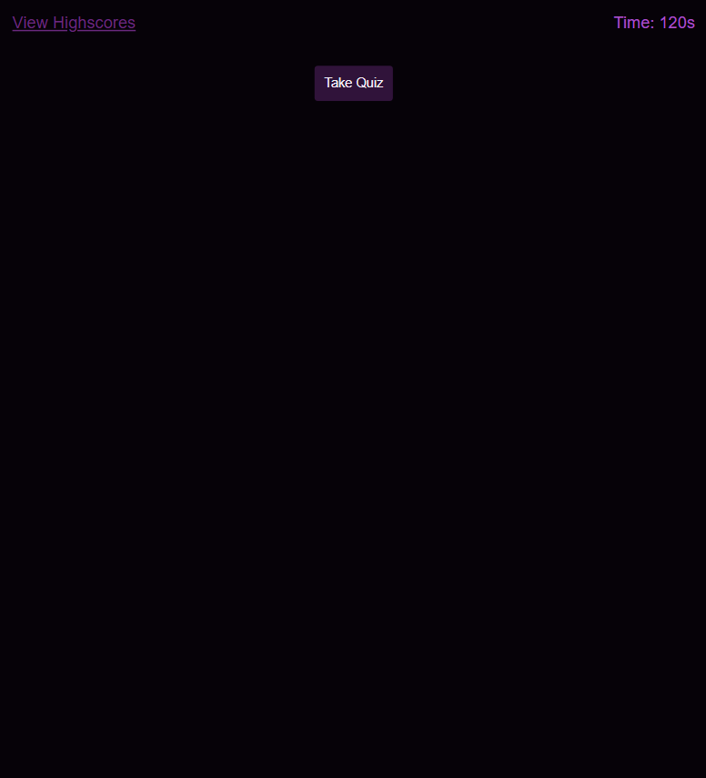
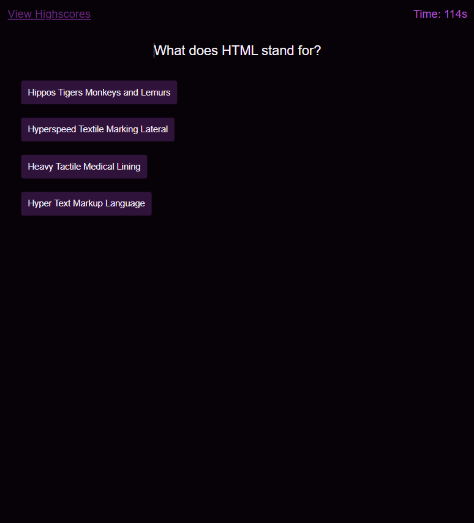
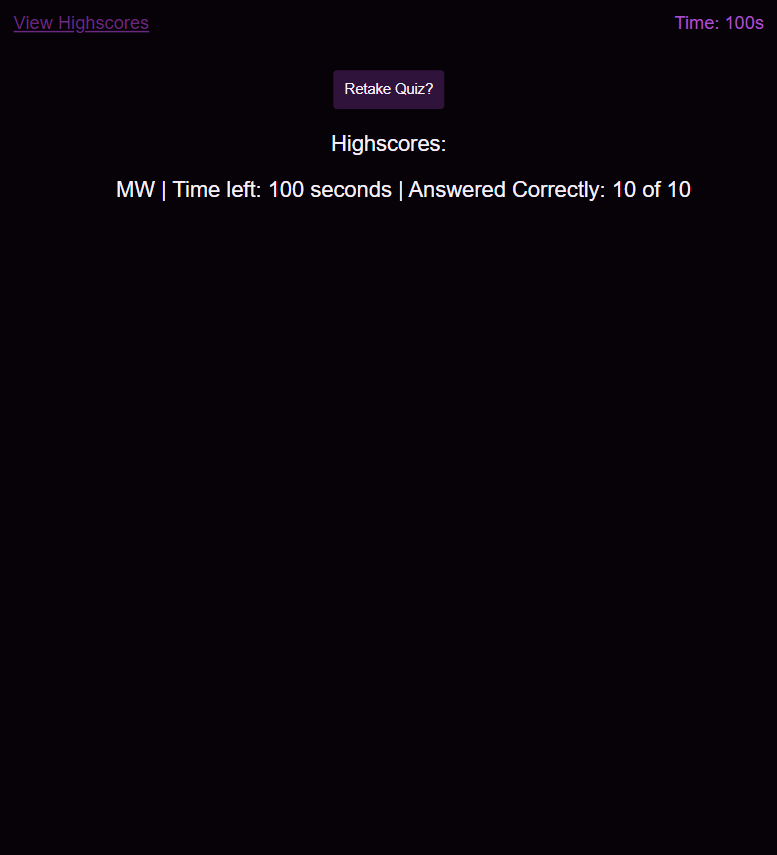

# Coding Quiz Challenge 

This web application is designed to be a small coding quiz that can be added upon in the future. Its a fun way for the user to test their knowledge on web development.

## Table of Contents

- [Technologies Used](#technologies-used)
- [Features](#features)
- [Functionality](#functionality)
- [Screenshots](#screenshots)
- [Website Link](#website-link)
- [Credits](#credits)

## Technologies Used

- **HTML**: The Structure of the Webpage.
- **CSS**: Styles for the application with added variables for consistent theming
- **JavaScript**: Powers the dynamic aspects of the quiz including: rendering the questions, starting and stopping the timer, highscore logging and more.

## Features 

- **Timed Mechanics**: The quiz is time-bound, creating a sense of urgency and competitive spirit. Users have exactly 120 seconds to answer all questions.
- **Dynamic UI**: As users navigate through the quiz, questions and choices are rendered dynamically, providing a smooth user experience.
- **Penalty System**: To make the challenge more interesting, incorrect answers deduct 10 seconds from the timer, pushing users to make thoughtful selections.
- **Responsive Layout**: The design caters to a variety of screen sizes, ensuring a consistent user experience across devices.

## Functionality

1. **Quiz Start**: The quiz starts when the user clicks the "Take Quiz" button, hiding the button and then showing the questions and answer buttons.
2. **Question Rendering**: Each question is rendered in order from a pre-defined array. When the user click on the answer button it will record if the answer was correct or not and move to the next question.
3. **Scoring**: Correct answers will increase the user's score while incorrect answers will deduct 10 seconds from the timer. At the end of the quiz, users can view how many questions they answered correctly and the time that they had left over.
4. **Highscore Storage**: Users have the option to save their score locally using their initials. The "View Highscores" feature allows users to view a list of their saved highscores.

## Screenshots 

## Website Link

https://empireantz.github.io/timed-coding-quiz/

## Credits 

✨ This project was developed by your truly ✨